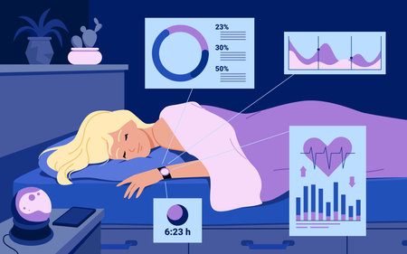

# Fitness Watch Data Analysis using Python

The proliferation of fitness watches and wearable technology has led to an explosion of personal health data, providing a rich source of information for fitness enthusiasts, healthcare professionals, and data scientists. Analyzing fitness watch data using Python allows us to derive meaningful insights into physical activity patterns, health metrics, and overall well-being. This analysis can lead to improved personal fitness plans, early detection of potential health issues, and a better understanding of how lifestyle factors influence health.
